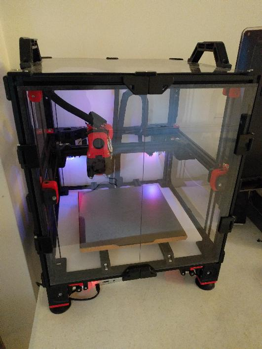

This repository documents modifications to my Voron2.4 250mm printer
(serial number V2.1114).

Assembly of the printer started in January of 2021.  The mechanics of
the printer mainly follow the standard Voron2.4 build at that time.

# Electronics

The printer uses a custom electronics setup using Huvud boards,
sensorless homing, and Klipper "multi-mcu" homing.  See the
[electronics document](electronics/electronics.md) for details.

# Bed

The printer bed heater is controlled by a separate thermistor on the
aluminum heat spreader and it uses cork board for insulation.  See the
[bed document](bed/bed.md) for details.

# Panels

Several minor changes were made to the exterior enclosure.  Details
are available in the [panels document](panels/panels.md).
