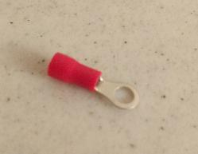
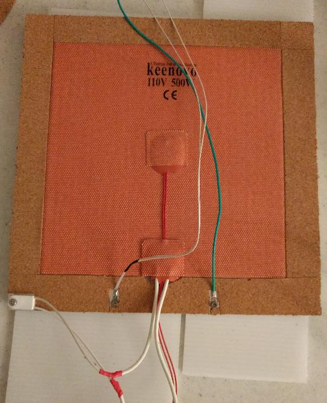
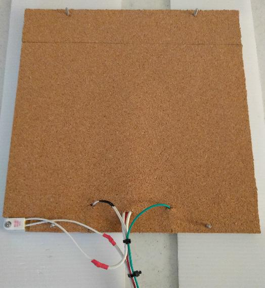
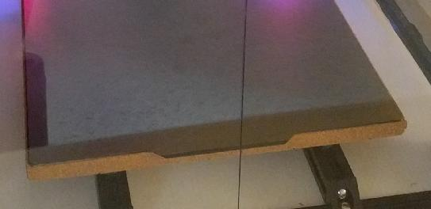

This document describes modifications to a Voron2.4 heated bed.

The printer has a standard 250mm aluminum heat spreader and 200mm
Keenovo heater (purchased as a kit from DigMach).  On top of the
aluminum heat spreader is a magnetic sheet and PEI covered spring
steel sheet (purchased from Energetic).

# Thermistor on aluminum heat spreader

The standard thermistor on the back of the Keenovo heater does not
provide an accurate estimate of the bed surface temperature.  I
deployed a separate thermistor attached directly to the aluminum heat
spreader to improve temperature estimates.

I used a generic "NTC 3950" glass bead type thermistor (purchased from
Amazon as a ten pack).  To mount it to the bed I started with a common
"22-16AWG ring wire connector":

I then used two pairs of pliers to remove the red plastic sheathing
from the connector.  This left just the metal part of the ring
connector.  The glass bead on the thermistor was small enough to pass
through the wire tube on the connector.  Using a standard crimping
tool, I slightly crimped the part of the wire tube nearest the ring,
such that the glass bead could enter the wire tube but not pass all
the way through it.  With the glass bead inside the tube I then
carefully crimped the wire tube furthest from the ring, such that the
glass bead was trapped inside the tube.  I then carefully crimped
either side of the tube so as to remove any movement of the glass bead
within the tube.  It is relatively easy to break the glass bead on the
thermistor - it is a good idea to buy extra thermistors if attempting
the above procedure.

Finally, I used an M3 screw to mount the resulting "ring connector
with thermistor" to the underside of the aluminum heat spreader.

# Insulated bed

I used cork board to insulate the bed.  I did this for three reasons:
to better promote a consistent bed surface temperature at the edges
and corners of the bed, to improve the bed surface temperature
estimate from the thermistor mounted under the bed, and to improve the
bed aesthetic.

I used "2mm thick cork sheets with self-adhesive" (purchased from
Amazon). I started by cutting sections of a cork sheet so that they
fit around the bed heater and other components on the bottom of the
aluminum heat spreader:

From left to right, the components at the bottom of the above picture
are: the bed fuse (115 degrees Celsius), the "NTC 3950 thermistor on
ring connector", the Keenovo wires, and the ground wire.

The second layer of cork board was then applied on top of the first
layer:

The cork sheets that I purchased were not large enough to fully cover
the bed with a single sheet.  So, I used multiple sheets to cover the
full space.

I intentionally routed the ground and thermistor wires towards the
center of the bed for better heat insulation at the sides and so that
those wires would not pull down on the cork board.

Finally, I cut strips of cork board and attached them to the sides of
the bed:

